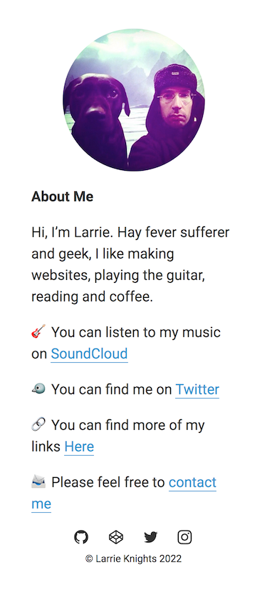
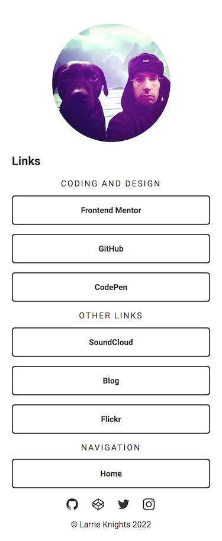

# My personal website

## Table of contents

- [Overview](#overview)
  - [Screenshots](#screenshots)
  - [Links](#links)
- [My process](#my-process)
  - [Built with](#built-with)
  - [What I learned](#what-i-learned)
  - [Useful resources](#useful-resources)
- [Author](#author)
- [Acknowledgments](#acknowledgments)

## Overview

### Screenshots

##### Home Page


##### Links Page


### Links

- [Live Site](https://larrieknights.com)

## My process

### Built with

- HTML
- CSS
- Javascript

### What I learned

To update the year in the footer dynamically I used the Javascript date object: 

```javascript
<script type="text/javascript">
  document.write(new Date().getFullYear());
</script>
```

---

To add a hover effect with animation to the social icons I used the CSS `transition` property:

```css
.footer__social a svg path {
  transition: fill 150ms ease-in-out;
}
```

---

To use emojis in HTML find the unicode for the emoji you want, remove the `U` and the replace it with `&#x` then add `;` at the end.

```html
<p>&#x1F3B8;<p>
```

Displays the :guitar: emoji

---

If the user wants to add the site as a PWA (Progressive Web App) to iOS or iPadOS home screen, you need to add the code below to display a nice icon.

The icon needs to be square size 180px x 180px for retina displays, do not add rounded corners as this is added by the OS:

```html
<link rel="apple-touch-icon" sizes="180x180" href="img/apple-touch-icon.png">
```


### Useful resources

- [Update Your Footer](https://updateyourfooter.com/) - This helped me to automatically update the year dynamic timestamp.
- [Favicon Generator](https://realfavicongenerator.net/) - this helped me create the favicons. 
- [W3 Schools - How TO - CSS/JS Modal](https://www.w3schools.com/howto/howto_css_modals.asp) - This helped me create the modal box for the contact form.
- [formsubmit.co](https://formsubmit.co/) - For the contact form.
- [Holly Bourneville - How to use Emojis in HTML](https://hollybourneville.medium.com/how-to-use-emojis-in-html-b3c671e21b92)
- [emojipedia.org](https://emojipedia.org/) - To find emojis and the Unicode

## Author

- Larrie Knights - [Website](https://larrieknights.com)
- Twitter - [@512kilobytes](https://www.twitter.com/512kilobytes)

## Acknowledgments

- Thanks to the excellent [Coder Coder YouTube channel](https://www.youtube.com/c/TheCoderCoder) for the tutorial to make the links page.
